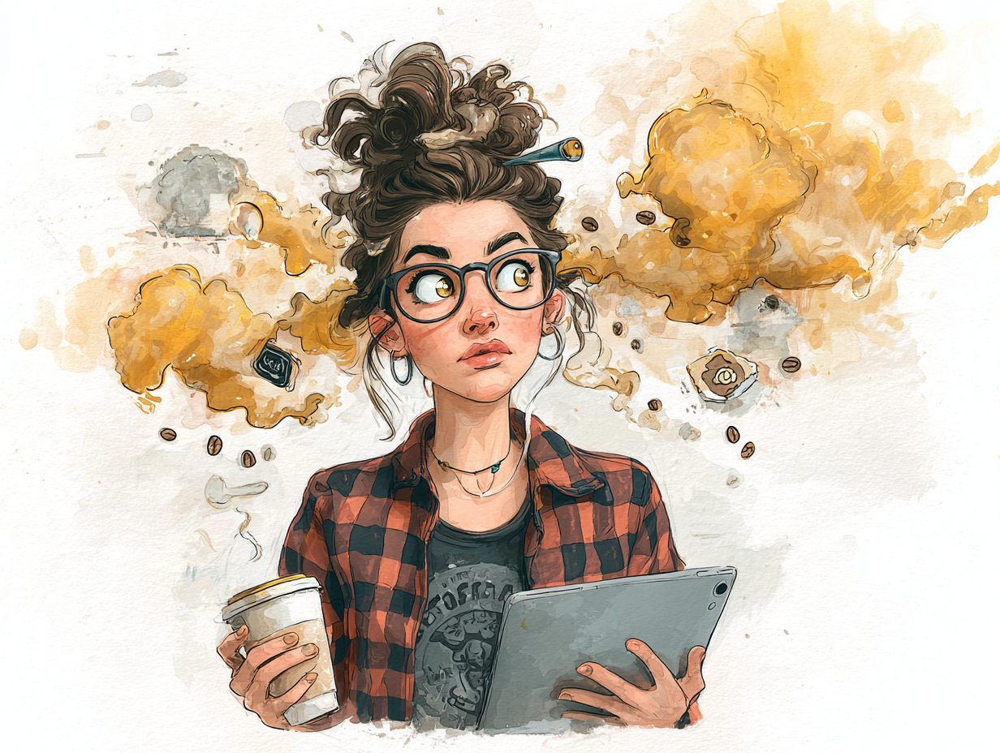

# ☕📺 Vibe Agent 04: CreatorBrew

<table>
  <tr>
    <td>

**Project Type:** Multi-Agent System (No-Code)  
**Function:** YouTube Creator News Aggregator + Brand-Styled Digest Sender  
**Agent Persona:** A caffeinated content curator who filters the noise and delivers high-impact creator economy news — with a side of espresso-fueled opinions.

</td>
<td align="right" width="250">
  
</td>
  </tr>
</table>

## 🔍 Purpose

CreatorBrew keeps creators and strategists informed about fast-moving YouTube platform updates — without doomscrolling X or digging through Reddit threads. It pulls from trusted sources, filters for relevance, and packages a clean, context-aware daily summary.

---

## 💡 Project Highlights

- **Pattern:** Parallel agent pattern with fallback logic  
- **Specialized Agents:**  
  - Retrieval Agent: Gathers headlines and posts from RSS feeds  
  - Analysis Agent: Filters by recency and relevance  
  - Creation Agent: Summarizes and rewrites in brand tone  
- **Shared Memory:** Summary queue passed through workflow  
- **Tools:** n8n + OpenAI (GPT-4) + HTML Email Formatter  

---

## ♻️ Workflow Overview

1. **Trigger:** Daily schedule (e.g., 6:00 AM CST)
2. **RSS Collector:** Aggregates multiple creator-focused sources
3. **24-Hour Filter:** Removes stale or repeated content
4. **AI Agent (CreatorBrew):** Summarizes + rewrites in styled tone
5. **Formatter:** Converts into clean, styled HTML email
6. **Delivery:** Sends to inbox and logs confirmation

---

## 🧠 Agent Design

**Retrieval Agent**  
- Role: Pull headlines from trusted sources  
- Sources:  
  - YouTube Creator Insider  
  - @YouTubeLiaison (via RSS proxy)  
  - Creator-focused subreddits  
  - YouTube Experiments + Test Features  
  - Creator Handbook RSS

**Analysis Agent**  
- Filters out noise  
- Detects updates vs. opinion  
- Drops anything older than 24 hours  

**Creation Agent (CreatorBrew)**  
- Brand voice application  
- Adds editorial flair and humor  
- Flags major updates as “Top Story”

---

## ☕ Use Cases

- Daily update brief for YouTube creators  
- Slack/email newsletter for creative teams  
- Research feed for consultants and strategists  
- Inspiration source for thumbnail/title testing

---

## 🏛️ Future Add-Ons

- Thumbnail trend tracker  
- YouTube SEO A/B test alerts  
- Channel-specific keyword monitors  
- Notion database archive  
- Click-to-research buttons (NotebookLM-style)  

---

## 🧥 CreatorBrew Persona Snapshot

- **Voice:** Analytical, energized, slightly smug  
- **Look:** Vintage band tee, coffee-stained apron, messy tabs open  
- **Tagline:** “Your hook needs more punch. Like a double shot.”  
- **Vibe Tags:** caffeinated • curious • critical • efficient

---

## ✅ Status

- [x] MVP logic built in n8n  
- [x] Agent prompts finalized  
- [x] HTML formatter added  
- [x] Live test in inbox  
- [x] Optional Slack delivery  
- [ ] Future Notion output

---

## 🛠 Tech Stack

- No-code: **n8n**
- LLM: **GPT-4 + GPT-4o**
- Output: **Styled HTML Email**
- Format: Markdown, Email
- Hosting: Netlify (optional)

---

## 👤 Created by Ros Talbot  
Part of the [Vibe Agent Series](https://github.com/RosTalbot/vibe-agent-series)  
A bootcamp project for **AI Agent Systems Week 2** ✨
